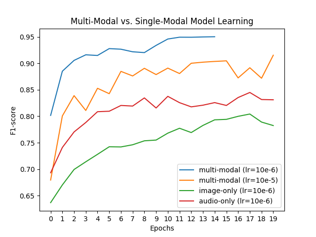

# Multi-Input ResNet

**multi-input.py**
- Multi-input neural net (2D image and 1D audio data).
- Calls ResNet.py for 1D and 2D residual network processing.

**ResNet.py**
  - Residual network class for 2D image data and 1D (audio) data.
  - Can be used to train model end to end or for transfer methods with head/tail layers removed. 

**segmented_data_builder.py**
  - Builds TensorFlow Dataset for dynamic loading of data for models.
  - Includes embdedding/multi-hot methods for label transformations.
  
**focal_loss.py**
  - Multi-class, multi-label Focal Loss function.
  - Parameter 'alpha' is a class weighting array where each element in the array corresponds to the weighting factor for that specific class. For example, if classifying 5 different classes then alpha should be a (1,5) array of weights.
  - Focal Loss results display a dramatic increase in performance over Binary Crosstropy (validation F1-score from 0.5 with BCE to 0.93 with Focal Loss) for this network trained on a subset of the Youtube8M dataset.
  
  ## Learning Results
  
  Above displays learning results of running a multi-input model (image and audio) versus a single input model (image or audio). 
  
  ## Multi-Input Network Graph
  

